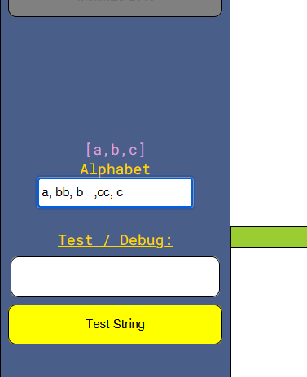
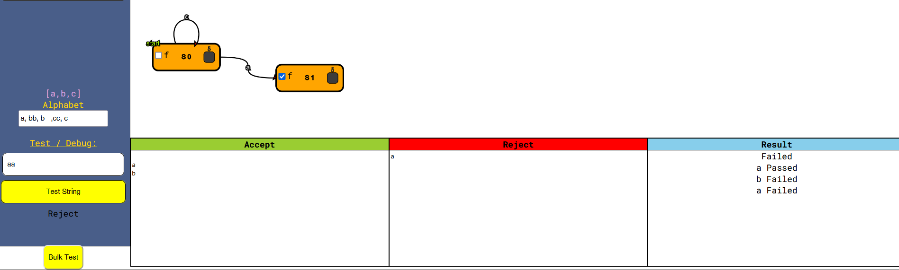

# fortnite-automaton

## Current Features

- Design FA
- Determine FA type
- Convert NFA to DFA
- Minimize DFA
- Test strings
- Save FA to JSON and Load FA from JSON

## Lacking Features

- Edit existing transitions

## User Guide

### Creating a state

Double click on the canvas to create state.

Make a state a **final state** by checking the checkbox labeled "f".

s0 is always the start state.

### Creating a transition between states

Click on the black square and hold your mouse, a line will appear.

Drag the line to a state, and release your mouse. A transition between the two states will be made, and you will be asked to enter a character for the transition.

### Setting up alphabet

Seperate each letter by a comma.
Only a string of length 1 will be loaded.

### Test strings

You can test one string at a time or use the bulk-test feature.

For bulk testing, seperate each string by a new line.
The result will pass or fail depending on if the strings are accepted or rejected as expected.

